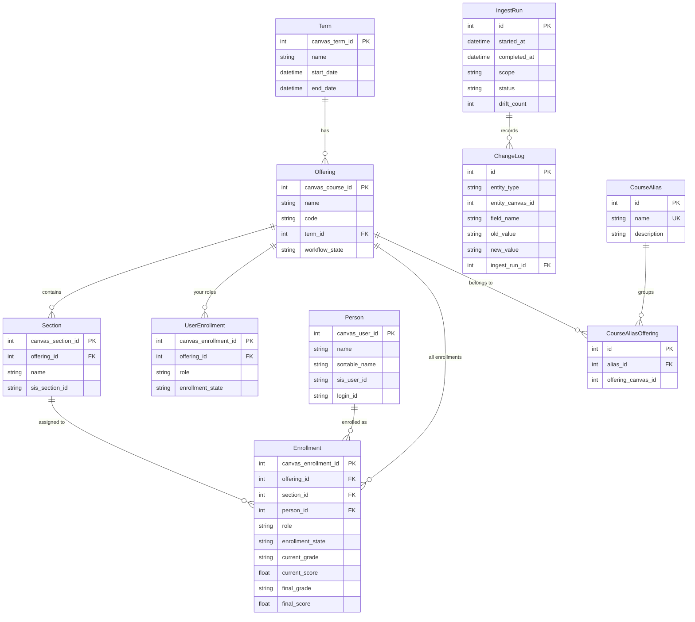

# Data Model

Understanding what canvas-ledger tracks and where it stores data.

## File Locations

canvas-ledger stores all data locally. Here's where everything lives:

| File | Default Location | Purpose |
|------|------------------|---------|
| **Configuration** | `~/.config/cl/config.toml` | Canvas URL, database path, preferences |
| **Database** | `~/.local/share/cl/ledger.db` | All observed and declared data |
| **Backups** | `~/.local/share/cl/ledger.db.backup.*` | Auto-created before migrations |

!!! tip "Custom Locations"
    You can customize the database path in your config file:
    ```toml
    [database]
    path = "/path/to/your/ledger.db"
    ```

### What's in the Config File

```toml
# ~/.config/cl/config.toml
[canvas]
base_url = "https://auburn.instructure.com"

[database]
path = "~/.local/share/cl/ledger.db"

[secrets]
provider = "env"  # or "1password"
```

!!! warning "Tokens Are Never Stored Here"
    Your Canvas API token is retrieved from environment variables (`CANVAS_API_TOKEN`) or 1Password—never written to the config file.

### Database File

The database is a standard SQLite file. You can:

- **Back it up**: Just copy the file
- **Inspect it**: Open with any SQLite tool (DB Browser, `sqlite3` CLI, etc.)
- **Move it**: Copy to another machine and update your config
- **Version control it**: If you want history of your ledger itself

## Entity Relationship Diagram



## Observed Data (from Canvas)

These entities store data exactly as Canvas reports it.

### Term

Academic periods (semesters, quarters, etc.).

| Field | Description |
|-------|-------------|
| `canvas_term_id` | Canvas's unique identifier |
| `name` | Term name (e.g., "Fall 2024") |
| `start_date` / `end_date` | Term boundaries |
| `observed_at` | When first seen |
| `last_seen_at` | When last confirmed |

### Offering

A specific course instance (what Canvas calls a "course").

| Field | Description |
|-------|-------------|
| `canvas_course_id` | Canvas's unique identifier |
| `name` | Course title |
| `code` | Course code (e.g., "COMP 1234") |
| `term_id` | Link to Term |
| `workflow_state` | Status: available, completed, deleted |

### Section

Subdivisions within an offering.

| Field | Description |
|-------|-------------|
| `canvas_section_id` | Canvas's unique identifier |
| `name` | Section name (e.g., "Section 001") |
| `sis_section_id` | Institutional identifier if available |

### Person

Any user encountered through enrollments.

| Field | Description |
|-------|-------------|
| `canvas_user_id` | Canvas's unique identifier |
| `name` | Display name |
| `sortable_name` | Last, First format |
| `sis_user_id` | Institutional ID (e.g., student ID) |
| `login_id` | Login username |

### Enrollment

A person's enrollment in an offering (deep ingestion).

| Field | Description |
|-------|-------------|
| `canvas_enrollment_id` | Canvas's unique identifier |
| `role` | Role type: StudentEnrollment, TeacherEnrollment, TaEnrollment, etc. |
| `enrollment_state` | Status: active, invited, completed, deleted |
| `current_grade` | Letter grade as of ingestion (e.g., "B+") |
| `current_score` | Numeric score as of ingestion (e.g., 87.5) |
| `final_grade` | Final letter grade if concluded |
| `final_score` | Final numeric score if concluded |

### UserEnrollment

Your own enrollments (catalog ingestion only).

| Field | Description |
|-------|-------------|
| `role` | Your role: teacher, ta, student, designer, observer |
| `enrollment_state` | Status: active, completed, etc. |

This is a lightweight version of Enrollment, populated during catalog ingestion before you deep-ingest specific offerings.

## Declared Data (Your Annotations)

These entities store your corrections and classifications.

### LeadInstructorAnnotation

Declares who was lead/grade-responsible for an offering.

| Field | Description |
|-------|-------------|
| `offering_canvas_id` | Which offering |
| `person_canvas_id` | Who is lead |
| `designation` | "lead" or "grade_responsible" |

### InvolvementAnnotation

Classifies your involvement beyond what Canvas shows.

| Field | Description |
|-------|-------------|
| `offering_canvas_id` | Which offering |
| `classification` | Free text: "developed course", "guest lecturer", etc. |

### CourseAlias

Groups related offerings under a common name.

| Field | Description |
|-------|-------------|
| `name` | The alias (e.g., "intro-computing") |
| `description` | Optional explanation |

### CourseAliasOffering

Links offerings to aliases (many-to-many).

| Field | Description |
|-------|-------------|
| `alias_id` | Which alias |
| `offering_canvas_id` | Which offering |

## History Tracking

### IngestRun

Metadata about each ingestion operation.

| Field | Description |
|-------|-------------|
| `scope` | "catalog" or "offering" |
| `scope_detail` | For offerings: which course ID |
| `status` | running, completed, failed |
| `new_count` | Records created |
| `updated_count` | Records modified |
| `unchanged_count` | Records unchanged |
| `drift_count` | Changes detected |

### ChangeLog

Records every field change across ingestion runs.

| Field | Description |
|-------|-------------|
| `entity_type` | What changed: term, offering, enrollment, etc. |
| `entity_canvas_id` | Canvas ID of the changed entity |
| `field_name` | Which field changed |
| `old_value` | Previous value |
| `new_value` | New value |
| `ingest_run_id` | Which ingestion detected this |

This enables drift queries like "what changed for this student?" or "what changed in this course?"

## Timestamps

Every observed entity includes:

- **`observed_at`**: When the record was first created
- **`last_seen_at`**: When the record was last confirmed in Canvas

If `last_seen_at` is old while other records are recent, the entity may have been removed from Canvas (but is preserved in your ledger).

## Canvas IDs vs Internal IDs

Annotations reference **Canvas IDs** (not internal database IDs). This means:

- Annotations survive if you delete and re-ingest offerings
- You can add annotations for users not yet in your ledger
- The ledger remains portable across database rebuilds

## Inspecting the Database

```bash
# Open with sqlite3 CLI
sqlite3 ~/.local/share/cl/ledger.db

# List tables
.tables

# See schema
.schema offering

# Query directly
SELECT name, code FROM offering WHERE code LIKE 'COMP%';
```

Or use a GUI tool like [DB Browser for SQLite](https://sqlitebrowser.org/).
